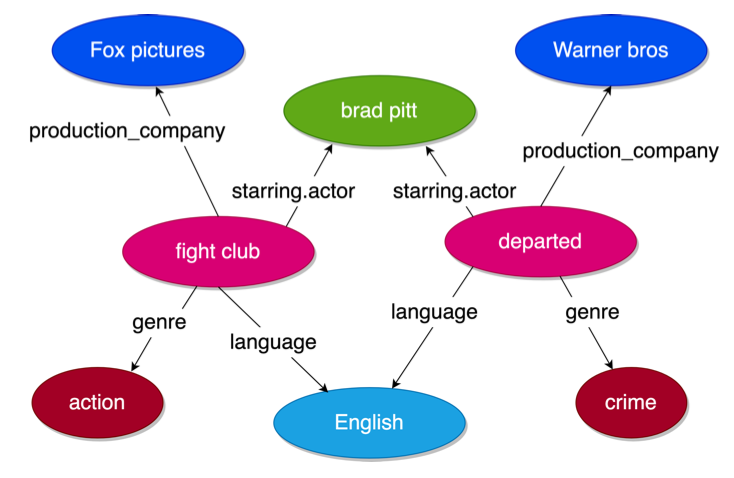
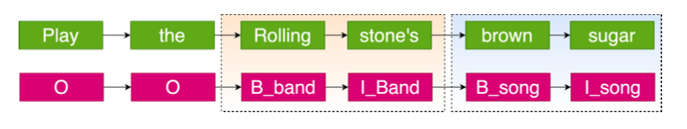

# Slot Tagging and Relation Extraction

This repo contains NLP models for slot tagging (sequence labeling task) and relation extraction (multilabel multitask classification) on movies dataset. Each folder are independent implementations stands independently of other folders. 

## Dataset Details:

1. Dataset consists of 3234 sentences with utterances including movie names, movie genres, actors, directors, producers, release dates, languages. The train and test set consists of 2253 and 981 samples respectively and a total of 19 classes. The test labels are not provided.
1. The task is to extract relations from the utterances where each utterance can have multiple possible classes.
1. Another task is to extract slot relations for each word in the utterance ( given as a BIO format).
1. The dataset is highly imbalanced. Oversampling technique is used in the code to balance the dataset.

The following models are implemented:

### Core Relation Extraction:

1. `core_relations/baselines`: Classical ML models like Decision Trees, Random Forest, Multinomial Naives Bayes, SVM, Logistic Regression with count-based, tfidf, glove feature vectors. For text preprocessing - POS tagging, NER information, oversampling and out-of-domain data is also used.
1. `core_relations/deeplearning`: Deep learning models like LSTM, BiLSTM, CNN, RNN, GRU, Transformer.

### Slot Filling:

1. `slot_tagging/`: The problem is treated as Sequence Labelling for LSTM, CRF and  word level classification problem for models like Decision Tree, Logisitic Regression.
1. `joint learning/`: Joint learning of slot tagging and relation extraction using huggingface transformers. Bert, Distilbert, Albert models are used. 
